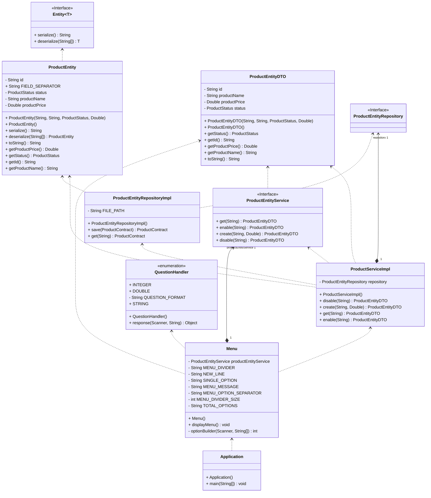
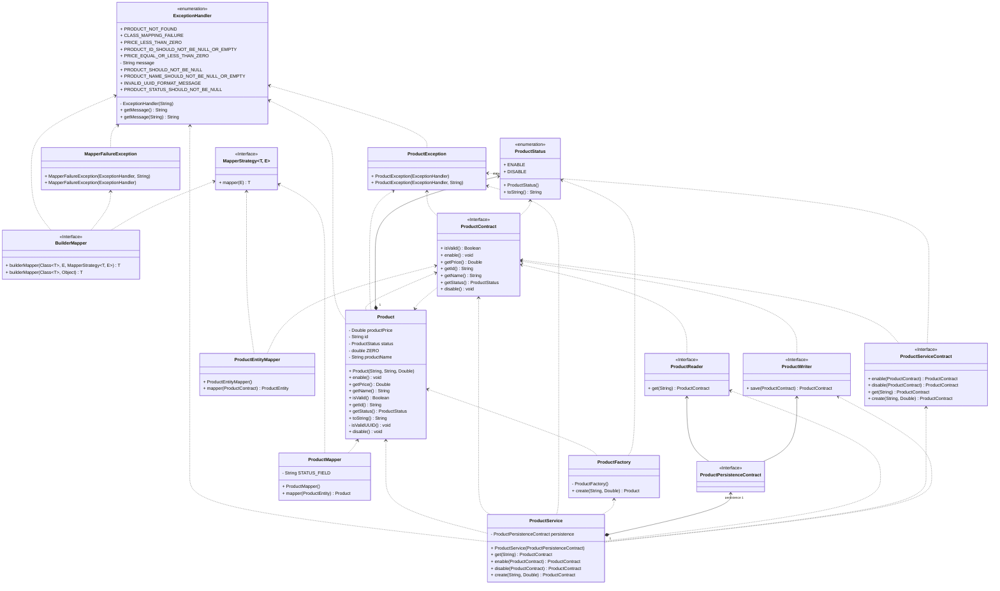

# Arquitetura Hexagonal 
[](https://github.com/diegosneves/hexagonal-architecture/actions/workflows/ci-develop.yaml)
[](https://wakatime.com/@diegosneves)

Conhecida também como **Ports and Adapters**, a Arquitetura Hexagonal é um padrão de design arquitetural focado em
desenvolver aplicações de maneira que não dependam de tecnologias específicas usadas em camadas de interface de usuário
ou persistência de dados. Esse padrão prioriza a separação de responsabilidades e organiza a aplicação em torno de um
domínio central.

No núcleo desta arquitetura encontram-se a lógica de negócio e os objetos de domínio. Interações com agentes externos,
como bancos de dados, interfaces da web, serviços de e-mail, entre outros, ocorrem através de abstrações denominadas
ports. Os adapters realizam a tarefa de converter os dados em formatos utilizáveis pelos ports e pelo domínio da
aplicação.

Essa estrutura permite que a aplicação seja mais mantida, testada e potencializa que quaisquer mudanças de tecnologias
na interface de usuário ou na persistência de dados afetem minimamente a lógica de negócio central.

---
# Como Configurar e Executar o Projeto na Sua IDE

Este projeto utiliza o padrão `REST` com Spring e `Java puro`. Aqui estão as etapas para configurá-lo e executá-lo na sua IDE:

## Pré-requisitos

1. **Java:** Este projeto é baseado em Java, então, você precisará ter ele instalado no seu sistema.

2. **IDE compatível:** Você vai precisar de uma IDE compatível com Java e Spring, como o IntelliJ IDEA ou o Eclipse.

## Configuração do Projeto

1. Clone o projeto do repositório GitHub para a sua máquina local usando o seguinte comando no terminal:

    ```shell
    git clone git@github.com:diegosneves/hexagonal-architecture.git
    ```

2. Abra a sua IDE de escolha e importe o projeto clonado. Geralmente, isso pode ser realizado selecionando `File -> Open` e navegando até o diretório do projeto.

3. Certifique-se de que sua IDE reconheceu corretamente o projeto como um projeto `Maven` e que todas as dependências necessárias foram baixadas corretamente.

## Execução do Projeto com Java puro

O projeto utiliza Spring Boot, o que simplifica a sua execução. No pacote `CLI`, você irá encontrar o ponto de entrada para o projeto. Aqui estão as etapas para rodá-lo:

1. Navegue até o diretório `src/main/java/diegosneves/github/hexagonal/adapters/` no pacote `CLI`.

2. Procure pela classe `Application.java` com o método `main()`. Esta é a classe principal que inicia a aplicação.

3. Clique com o botão direito na classe e selecione a opção `Run` para executar o projeto.

#### CLI



---

## Utilização da API REST

O projeto utiliza Spring Boot, o que simplifica a sua execução. Com o servidor agora em execução, você será capaz de interagir com a API REST por meio de protocolo HTTP. As operações de CRUD (Criar, Ler, Atualizar, Deletar) são geralmente mapeadas para os métodos HTTP POST, GET, PUT e DELETE respectivamente. 

Utilize o [swagger](#swagger), para enviar solicitações à API e receber respostas.

Esperamos que estas instruções auxiliem você a iniciar e configurar este projeto na sua IDE. Caso encontre qualquer problema, sinta-se à vontade para abrir uma "issue" no projeto no GitHub.

## Swagger

- [Swagger - Local](http://localhost:8080/swagger-ui/index.html)
- [Api - Docs](http://localhost:8080/v3/api-docs)


#### API - Rest

```mermaid
classDiagram
direction BT
class ControllerExceptionHandler {
  + ControllerExceptionHandler() 
  + generalError(Exception) ResponseEntity~ExceptionDTO~
}
class CorsConfig {
  + CorsConfig() 
  + corsFilter() CorsFilter
}
class ExceptionDTO {
  + ExceptionDTO(String, int) 
  - String message
  - int statusCode
  + message() String
  + statusCode() int
}
class HexagonalArchitectureApplication {
  + HexagonalArchitectureApplication() 
  + main(String[]) void
}
class OpenApiConfig {
  + OpenApiConfig() 
  - getInfo() Info
  - getTags() List~Tag~
  + customOpenAPI() OpenAPI
}
class ProductController {
  + ProductController(ProductEntityServiceContract) 
  - ProductEntityServiceContract entityServiceContract
  + getById(String) ResponseEntity~ProductResponse~
  + createProduct(ProductRequest) ResponseEntity~ProductResponse~
  + enableProduct(String) ResponseEntity~ProductResponse~
  + disableProduct(String) ResponseEntity~ProductResponse~
}
class ProductControllerContract {
<<Interface>>
  + enableProduct(String) ResponseEntity~ProductResponse~
  + createProduct(ProductRequest) ResponseEntity~ProductResponse~
  + disableProduct(String) ResponseEntity~ProductResponse~
  + getById(String) ResponseEntity~ProductResponse~
}
class ProductEntity {
  + ProductEntity() 
  + ProductEntity(String, String, ProductStatus, Double) 
  - String id
  - String productName
  - ProductStatus status
  - Double productPrice
  + getId() String
  + getProductName() String
  + getStatus() ProductStatus
  + getProductPrice() Double
  + setId(String) void
  + setProductName(String) void
  + setStatus(ProductStatus) void
  + setProductPrice(Double) void
  + builder() ProductEntityBuilder
}
class ProductEntityService {
  + ProductEntityService(ProductRepository) 
  - ProductRepository productRepository
  - ProductServiceContract productServiceContract
  + get(String) ProductResponse
  + create(ProductRequest) ProductResponse
  + disable(String) ProductResponse
  + enable(String) ProductResponse
}
class ProductEntityServiceContract {
<<Interface>>
  + enable(String) ProductResponse
  + disable(String) ProductResponse
  + get(String) ProductResponse
  + create(ProductRequest) ProductResponse
}
class ProductRepository {
<<Interface>>
  + save(ProductContract) ProductContract
  + get(String) ProductContract
}
class ProductRequest {
  + ProductRequest(String, Double) 
  + ProductRequest() 
  - String productName
  - Double productPrice
  + getProductName() String
  + getProductPrice() Double
  + setProductName(String) void
  + setProductPrice(Double) void
  + builder() ProductRequestBuilder
}
class ProductResponse {
  + ProductResponse(String, String, ProductStatus, Double) 
  + ProductResponse() 
  - ProductStatus status
  - Double productPrice
  - String id
  - String productName
  + getId() String
  + getProductName() String
  + getStatus() ProductStatus
  + getProductPrice() Double
  + setId(String) void
  + setProductName(String) void
  + setStatus(ProductStatus) void
  + setProductPrice(Double) void
  + builder() ProductResponseBuilder
}
class WebSecurityConfig {
  + WebSecurityConfig() 
  + securityFilterChain(HttpSecurity) SecurityFilterChain
}

ControllerExceptionHandler  ..>  ExceptionDTO 
ProductController  ..>  ProductControllerContract 
ProductController "1" *--> "entityServiceContract 1" ProductEntityServiceContract 
ProductController  ..>  ProductRequest 
ProductController  ..>  ProductResponse 
ProductControllerContract  ..>  ProductRequest 
ProductControllerContract  ..>  ProductResponse 
ProductEntityService  ..>  ProductEntity 
ProductEntityService  ..>  ProductEntityServiceContract 
ProductEntityService "1" *--> "productRepository 1" ProductRepository 
ProductEntityService  ..>  ProductRequest 
ProductEntityService  ..>  ProductResponse 
ProductEntityServiceContract  ..>  ProductRequest 
ProductEntityServiceContract  ..>  ProductResponse 
ProductRepository  ..>  ProductEntity 
```


---
#### Domain



---