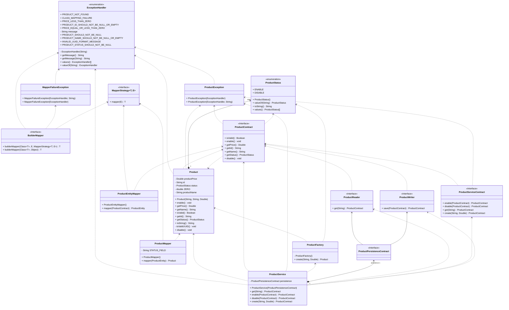

# Arquitetura Hexagonal

Conhecida também como **Ports and Adapters**, a Arquitetura Hexagonal é um padrão de design arquitetural focado em
desenvolver aplicações de maneira que não dependam de tecnologias específicas usadas em camadas de interface de usuário
ou persistência de dados. Esse padrão prioriza a separação de responsabilidades e organiza a aplicação em torno de um
domínio central.

No núcleo desta arquitetura encontram-se a lógica de negócio e os objetos de domínio. Interações com agentes externos,
como bancos de dados, interfaces da web, serviços de e-mail, entre outros, ocorrem através de abstrações denominadas
ports. Os adapters realizam a tarefa de converter os dados em formatos utilizáveis pelos ports e pelo domínio da
aplicação.

Essa estrutura permite que a aplicação seja mais mantida, testada e potencializa que quaisquer mudanças de tecnologias
na interface de usuário ou na persistência de dados afetem minimamente a lógica de negócio central.

---

## Swagger

- [Swagger - Local](http://localhost:8080/swagger-ui/index.html)
- [Api - Docs](http://localhost:8080/v3/api-docs)

---

#### API - Rest


---
#### Domain



---
#### CLI

```mermaid

```

---